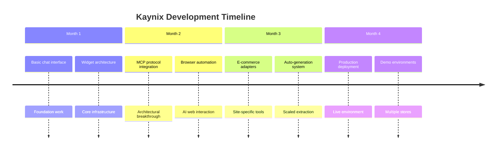
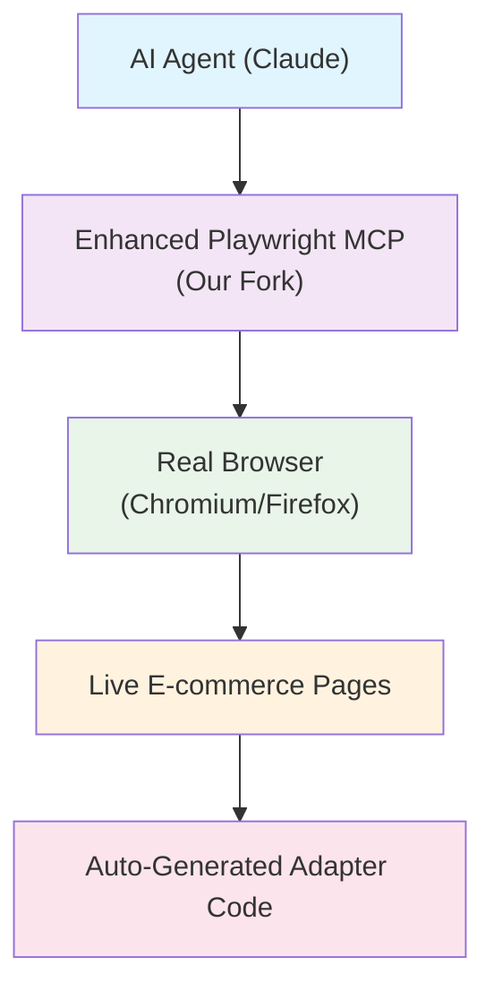
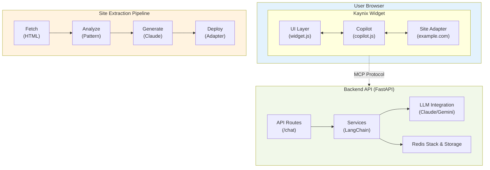
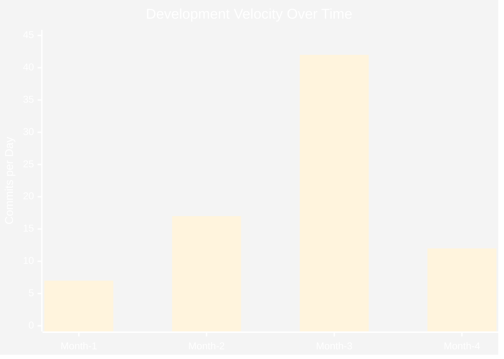

# AI-Assisted Development: 
## Building Kaynix in 3 Months
### From Cursor to Claude

^ Personal story: 20 years in engineering, never seen tools this powerful. This isn't theoretical - real project, real code, real results. Focus on workflow revolution, not just productivity gains. Audience will see both the incredible potential and honest challenges.

---

# The Journey in Numbers

## **Code Production**
- **1,371 commits** in 4 months (~11/day)
- **1.15M total lines changed**
- **~841 lines changed per commit** average
- **Peak days: 40+ commits**
- **79 test files** with **22K+ lines of test code**

---

## **AI Conversations**
- **~295 conversation sessions** with Claude
- **~132,000 total messages** exchanged
- **~447 messages per conversation** average
- **Continuous dialogue-driven development**

^ These numbers tell a story of unprecedented AI-assisted development velocity

^ Start with the raw numbers to establish scale. 132K messages = extensive technical dialogue, not quick Q&A. 447 messages per conversation shows deep collaboration sessions. 4.6 commits per conversation = compound productivity effect. This isn't just "AI helping" - it's a fundamental workflow transformation.

---

# The Problem: E-commerce is Broken

- Users struggle to find products across multiple sites
- Each site has different interfaces, filters, search
- No unified shopping experience
- AI could solve this... but how?

^ Set the stage - why this project matters

^ Keep this brief - audience wants to hear about AI development, not e-commerce. Establish that this was a real business problem requiring complex technical solution. The complexity of the problem justifies the sophisticated AI-assisted approach that followed.

---

# The Solution: Kaynix AI Shopping Assistant

- **Universal widget** that works on any e-commerce site
- **AI-powered product discovery** and recommendations  
- **Site-specific adapters** for deep integration
- **Conversational interface** for natural shopping

^ High-level vision - what you built

^ Again, keep brief - this is setup for the real story. Emphasize the technical complexity: universal widget, AI-powered, site-specific adapters. This is what made the AI-assisted development approach necessary - too complex for traditional development.

---

# The Workflow Revolution

## Traditional Development (Cursor Era)
- **File-centric thinking** - editing individual files
- **IDE-bound workflow** - typing code as primary activity
- **Sequential development** - one task at a time

## Claude-Powered Development 
- **System-centric conversations** - not thinking about files
- **Multiple Claude instances** running in parallel (3-4 tabs)
- **Collaborative UX** - ask/review/auto-accept pattern
- **Terminal-native workflow** - talking to agents, not editors
- **Primary activity shift** - conversing with AI vs typing code
- **Parallel problem-solving** - while one instance works, focus on others
- **Never waiting** - continuous progress across system components

^ This is the real breakthrough - a new way to think about development

^ **This is the core insight** - spend time here. Traditional: you think about files, edit code, sequential work. Claude: you think about systems, have conversations, parallel work streams. The parallel instances point is key - while one AI works, you focus on others. "Never waiting" - this is the game changer for productivity.

---

# Technical Architecture Evolution


      

^ Show progression from commits

^ Point out the evolution visible in commit messages. Month 1-2: Basic foundation work. Month 3: Major architectural breakthrough (MCP). Month 4: Production deployment and polish. This timeline shows rapid iteration enabled by AI assistance.

---

# The Parallel Development Pattern

**3-4 Claude Instances Running Simultaneously**

- **Main tab**: Primary feature development
- **Deep dive tab**: Investigating issues uncovered by main
- **Testing tab**: Validation and quality assurance  
- **Architecture tab**: System-wide refactoring

**While one instance works, focus shifts to others**
→ No waiting, continuous progress
→ Quality through parallel problem-solving

^ This workflow pattern is revolutionary

^ **This is the secret sauce** - emphasize this heavily. Most people think "one AI conversation at a time". Running 3-4 tabs means you're never blocked. When one AI is working on a large refactor, you shift to another for different problems. This pattern alone probably doubled productivity vs single-instance use.

---

# Example: Parallel Development in Action

**Scenario: MCP Integration Issues Discovered**

```
Tab 1 (Main): Implementing chat endpoint
→ Discovers authentication issues

Tab 2 (Deep Dive): Investigating auth flow
→ Finds broader API inconsistencies  

Tab 3 (Architecture): Refactoring entire auth system
→ While Tabs 1&2 continue their work

Tab 4 (Testing): Validating changes in real-time
→ Ensuring quality throughout
```

**Traditional workflow:** Sequential problem-solving, hours of blocking
**Claude workflow:** Parallel problem-solving, continuous progress

^ Real example from the Kaynix development

^ Walk through this specific example slowly. Traditional approach: fix auth issues, then API issues, then refactor - sequential, blocking. AI approach: all happening in parallel, continuous progress. This is why the productivity gains are exponential, not linear.

---

# The Playwright MCP Innovation
## Building the Missing Infrastructure

**Microsoft Released Playwright MCP → We Forked & Enhanced**

- **Forked Microsoft's baseline project**
- **Added 7 major enhancements in 3 phases**
- **Built comprehensive browser automation for AI**
- **Specialized tools for e-commerce analysis**

---

**What We Added:**

- JavaScript execution & script injection
- Network interception & storage management  
- Advanced DOM manipulation & accessibility
- Persistent browser sessions
- E-commerce extraction tools
- File-based data handling

^ Without this ecosystem, AI-powered web analysis would be impossible

^ Microsoft released basic Playwright MCP, but it wasn't enough for real AI web automation. You identified the gaps and filled them with 7 major enhancements. This shows how AI-assisted development enables contributing back to the ecosystem. Without these enhancements, the automated adapter generation wouldn't have been possible.

---

# The Complete AI Web Analysis Stack



---

#The Magic:
## AI can now "see" and interact with web pages like a human

- Extract product data in real-time
- Apply filters and navigate
- Generate site-specific adapter code
- Test and validate automatically

^ This is the missing piece that makes AI web automation practical

^ Show the complete stack - this is the infrastructure that enables everything else. AI can now "see" web pages, extract data, generate code, test automatically. This stack didn't exist before - you built it with AI assistance. Each layer enables the next - without enhanced Playwright MCP, no auto-generated adapters.

---

# The MCP Breakthrough
## How Velocity Enables Architectural Innovation

**The RAG Revolution Nobody Talks About**
- Traditional: Offline crawling → Vector search → Stale data
- **Kaynix**: In-browser MCP → Real-time extraction → Live user context

**This Innovation Came From Rapid Iteration, Not AI Suggestion:**
- Claude didn't suggest this architectural shift
- Previous solution (offline crawling) was flawed - painful and blocked
- Fast iteration revealed the fundamental problem with traditional RAG
- Speed allowed quick pivot to better approach
- In-browser, real-time approach emerged from experimentation

---

**Why This Works:**

- No Cloudflare blocks (we're already on the page)
- Real-time user state (what they're actually seeing)
- Direct LLM → Browser automation
- Site-specific tool generation on demand

^ AI velocity enabled architectural discovery, not architectural prescription

^ **Key point**: AI didn't suggest this architecture - velocity enabled discovering it. Fast iteration revealed the fundamental flaws in traditional RAG approaches. Only because you could iterate quickly did you discover that in-browser, real-time extraction was better. This is why velocity matters - it enables architectural breakthroughs you wouldn't find with slow iteration.

---

# AI-Generated Adapters

- **Automated site analysis** with visual markers
- **LLM-generated extraction code** 
- **Real-time testing and validation**
- **Support for 10+ major retailers**

```bash
# Generate adapter for any site
python site_analyze.py --url https://shop.warriors.com
```

^ Show the automation capability

---

# The Knowledge Paradox
## How AI Democratizes Complex System Architecture

**The Reality of Modern Software Development:**
- Hexagonal architecture
- MCP protocol implementation  
- Vector embeddings & Redis Stack
- LangChain orchestration
- Browser automation pipelines
- Multi-layered frontend architecture
- Microservice patterns
- Real-time analytics
- Cross-site security models

**No Single Human Can Master This Breadth**

^ The internet's knowledge is now at your fingertips through AI

---

# System Architecture Overview



**12,700+ lines of comprehensive system documentation**  
**Generated through AI conversations, not traditional planning**

^ Claude helped architect this entire enterprise-grade system

---

# Development Velocity Metrics



**Key Metrics:**
- **Peak productivity**: 40+ commits/day (~34K+ lines/day)
- **295 conversations** → **1,367 commits**
- **4.6 commits per conversation**
- **447 messages per conversation** average

^ The correlation between conversations and commits reveals the compound effect

---

# The Workflow Paradigm Shift

| Development Mode | Traditional | Claude Terminal |
|------------------|-------------|-----------------|
| **Primary Activity** | Typing code | Conversing with AI |
| **Thinking Unit** | Individual files | Entire system |
| **Work Pattern** | Sequential tasks | Parallel instances |
| **Development Speed** | Linear growth | Exponential acceleration |

**Result: ~90% AI-generated code with human architectural vision**
- All ideas and system design remain human-driven
- Implementation varies from hand-holding to wholesale delegation
- 295 conversations → 1,367 commits (4.6x multiplier effect)

^ This isn't just a tool upgrade - it's a new way of working

---

# Key Breakthrough Insights

1. **Knowledge Democratization** - AI gives you access to the entire internet's expertise
2. **Stop thinking about files** - Think in systems and conversations  
3. **Parallel AI instances unlock velocity** - 3-4 tabs working simultaneously
4. **Velocity enables architectural breakthroughs** - Fast iteration reveals better patterns
5. **Open source ecosystem leverage** - Fork, enhance, contribute back
6. **Human vision + AI implementation = Magic** - 90% AI-generated, 100% human-directed
7. **Terminal > IDE** - Conversational development beats code editing
8. **Quality through parallel problem-solving** - Not just speed, but better outcomes

**Result: Individual developers can now build enterprise-grade systems**

^ These aren't incremental improvements - they're paradigm shifts

---

# The Reality Check
## It's Not All Blue Skies

**The Frustrating Nights:**
- Fighting Claude to see things your way
- Wrestling with its interpretations of your requirements
- Claude forgetting patterns and losing context mid-conversation
- Late nights debugging AI-generated approaches that miss the mark

**But Here's the Thing - 20 Years of Engineering Perspective:**
- **Never encountered a tool this powerful** in two decades
- **Despite the frustrations, you feel superhuman**
- **Complex systems that would take teams months, built in weeks**

**The Trade-off is Absolutely Worth It**

^ Honest perspective after 3 months of intensive AI-assisted development

---

# Key Strategies That Unlock Productivity

1. **Break Problems Down Precisely - Make Claude Do It!**
   - Ask Claude to break down the problem into specific steps
   - Force it to think through dependencies and edge cases

2. **Use AI-Generated Tracking Documents**
   - Make Claude create and maintain progress tracking
   - Use structured documents to maintain context

3. **Test, Test, Test - You MUST Validate Everything**
   - AI-generated code looks perfect but often has subtle bugs
   - Test immediately after each change, don't accumulate debt

4. **Use `# STRICT RULES` for Critical Patterns**
   - Put absolute requirements in markdown headers
   - Works great until context limits hit (then restart with rules)

^ Practical tips from real-world AI-assisted development

---

# Real Messages: The Complexity of AI-Assisted Development

**Example 1: Ultra-Detailed Implementation with Critical Edge Cases**

```
STEP 1: Test Filter Click Behavior - CRITICAL NAVIGATION CHECK
1. First determine the filter implementation type:
   // CRITICAL: Test if filter links have onclick handlers that prevent navigation
   
2. CRITICAL DECISION POINT:
   - If requiresNavigationWorkaround is TRUE: You MUST implement navigation-based filtering
   
CRITICAL EDGE CASES TO HANDLE:
1. Filter Matching: Use EXACT match first! 
   - BAD: label.includes('S') matches 'XS' when looking for 'S'
   - GOOD: label === 'S' || label.toLowerCase() === 's' exact match first
```

---

**Example 2: Process Control Struggles**

```
CRITICAL: Do NOT attempt to write the entire adapter at once. 
You must follow these steps in the specified order.

The skeleton adapter is just the STARTING POINT. 
You MUST implement ALL methods in Steps 2-5.

The skeleton will FAIL all tests because methods 
throw "Not implemented yet" errors.

REMINDER: You MUST complete ALL 6 steps. 
Each method that throws 
"Not implemented yet" MUST be replaced 
with working code.
```

^ These aren't simple "write me a function" requests - they're complex orchestration of AI behavior

---

# Why Claude > Cursor
## The Transition Was Evident From Day One

**If you're writing new code, refactoring, or testing - you must try Claude**

**Key Advantages:**
- **Conversation-driven development** vs IDE-bound suggestions
- **System-level thinking** vs file-level assistance  
- **Complex refactoring capabilities** - wholesale system changes
- **Architecture discussions** - AI as design partner
- **Multiple parallel instances** - impossible with traditional tools
- **Terminal workflow** - no context switching to IDE

**The Productivity Unlock is Immediate**

^ This transition unlocks development superpowers

---

# Production Results

- **Live widget** deployed to Firebase CDN
- **Real e-commerce integration** with major retailers
- **Automated testing** pipeline
- **Performance monitoring** and analytics
- **Demo environments** for multiple store types

^ Show what you actually shipped

---

# LIVE DEMO
## Kaynix in Action

**Demo Flow:**
1. Navigate to demo store
2. Show AI assistant interaction
3. Product search and filtering
4. Cart operations
5. Cross-site capabilities

^ Interactive demonstration

---

# The Future of AI-Assisted Development

- **Velocity increases** of 3-5x achievable
- **Architecture evolution** becomes natural
- **Testing and deployment** fully automated
- **Documentation** generated from conversation
- **Pair programming** with AI as senior developer

^ Forward-looking insights

---

# Questions & Discussion

**Contact:**
- GitHub: AshKash/kaynix
- Portfolio: ashwinkashyap.ai
- Demo: kaynix.ai

**Key Takeaway:** AI isn't replacing developers - it's making us 10x more productive

^ Wrap up and engage audience

---

# Appendix: Technical Deep Dive

- MCP Architecture Details
- Adapter Generation Process  
- Performance Metrics
- Code Quality Analysis
- Deployment Pipeline

^ Additional technical details if needed